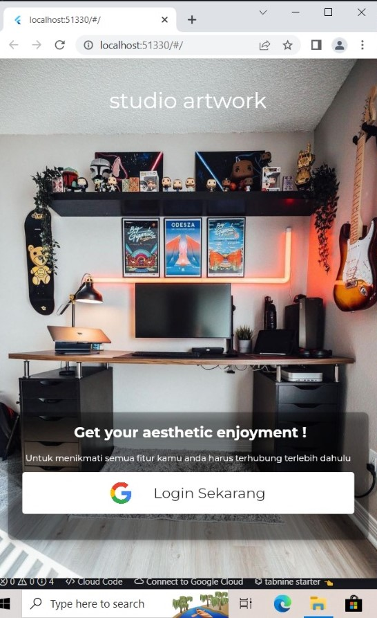
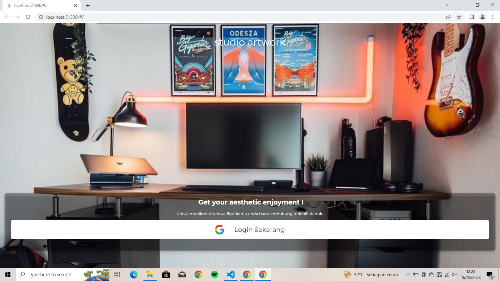

# Login from google dengan Flutter

**
Nama: Irgi Jaelani
**
**
Kelas: TI.21.A.3
**
**
NIM: 312110618
**
**
Hari, Tanggal  : Selasa, 16 Mei 2023
**

## Output 

Berikut, hasil tampilan sebelum dan sesudah mengisi field:

